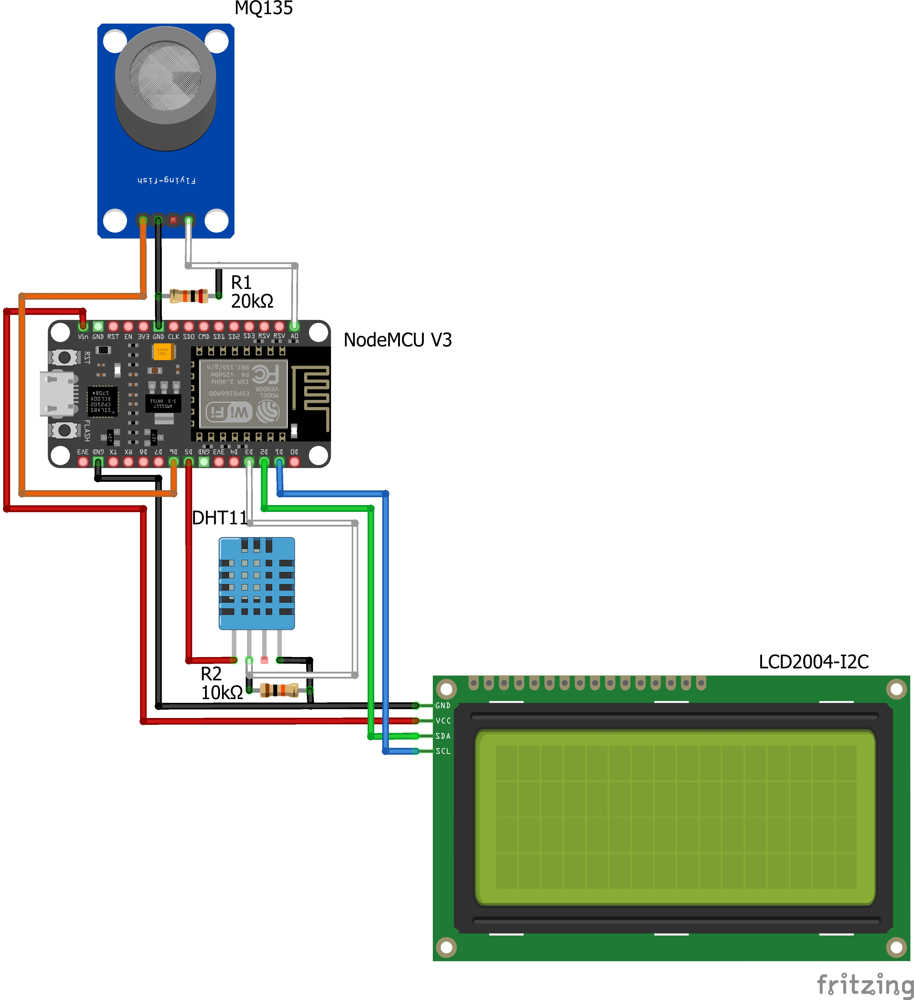

# ESP8266/32 Server to Monitoring of Environmental Indicators Inside of Building

## Basic idea
Using ESP8266/32 microcontroller to retrieve MQ135 (CO2) and DHT11 (temperature and humidity) sensor data and display them in the local network via a web server with events technology using the microcontroller over the local network, as well as duplicate the output on the I2C LCD screen. The solution uses OTA update via wifi and syncs the local clock at startup via an NTP server on the internet.  

## Solution soldering scheme
 

## Web service with events work demonstration

## Power request
* ESP with sensors only 0.08 to 0.11 A. 
* ESP with sensors and LCD from 0.11 to 0.17A.
As result - not a very good solution, because 5 000 mAh battery in the first case works only about 45 -60 hours. In the second 29 - 45 hours. 
After rebuild request new testing. 

## Future works
1. ~~Realize more readable local web page~~ (Done, LCD and WEB page use different date and time output line, improved local web page work with events and usage of JSON data)
2. Create a public MySQL DB to send data to it
3. Create a public web page with google maps integration and device data publishing on it  

## Find problems
1. Hight energy usage, possible - a system not required to turn on sensors all time. 
  * ~~For temperature/humidity sensor work time must be maybe 10 sec. every 10 min.~~ (done) 
  * ~~CO_2 sensor 15 min every 60 min.~~ (done)
  * ~~As a result, the soldering scheme must be changed to give possibility turn sensors on/off.~~ (done)  
